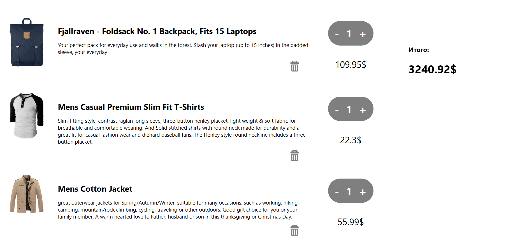

# Implementation of the store catalog

## Made the following:
- Changing the quantity of an item added to the cart;
- Removing an item from the cart;
- Calculating the current total value of items in the cart;

## 🚀 Follow the steps below to work with the application:

Install the package manager

### `npm install`

Start the application

### `npm start`

## Available scripts

In the project directory you can run:

### `npm start`.

Starts the application in development mode.\
Open [http://localhost:3000](http://localhost:3000) to view it in a browser.

The page will reload if you make edits.
You will also see all lint errors in the console.
